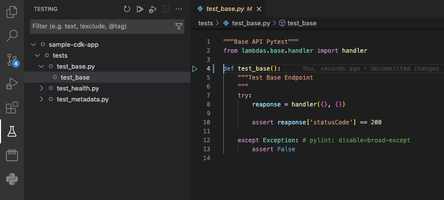

# AWS SDK Stack

## Overview

This is a simple example of a Python based CDK Stack which contains:
- REST API handling via API Gateway and AWS Lambda
- CD/CI deployment using AWS CodePipeline which is trigger by Github
- Test suite uses Pytest, which is best used in conjunction with VSCode

Full disclosure, if you want a very quick out-of-the-box REST API based solution, look towards using `Netlify`, `AWS Amplify`, `AWS SAM` or the `Serverless Framework`. This is a solution that, though not as out-of-the-box, will theoretically prevent future growing pains as your project grows.

Below is made up of the following sections:
* [Set up Github Token](#set-up-github-token)
* [Intial setup](#intial-setup)
* [Deploying your application](#deploying-your-application)
* [Testing](#testing)
* [Risks associated with this solution](#risks-associated-with-this-solution)

This creates the following URLs:
* [Basic API Endpoint](https://39jxidap25.execute-api.ap-southeast-2.amazonaws.com/prod/v1/)
* [Metadata API Endpoint](https://39jxidap25.execute-api.ap-southeast-2.amazonaws.com/prod/v1/metadata)
* [Health Endpoint](https://39jxidap25.execute-api.ap-southeast-2.amazonaws.com/prod/v1/health)

## Getting Started

### Set up Github Token

AWS CodePipeline requires access to Github to pull down the repo and read from the repo hook.

1. In Github, go to `Profile > Settings > Developer Settings > Personal access tokens` and click `Generate new token`
2. In the options below, select `repo` and `admin:repo_hook` as shown below:


3. Click `Generate Token` and keep this token somewhere safe like `1Password`
4. Log into the `AWS Console` and nagivate to `AWS Secrets Manager` and click `Store a new secret`
5. Select `Other type of secret` and paste in the newly created github token as plaintext as shown below:


6. Click `Next`, put `github-token` as the `Secret name` then click `Next`, then `Next` again and finally `Store`

Congradulations you have successfully set up your github token in AWS!

## Intial setup

This solulutions uses [AWS CDK](https://docs.aws.amazon.com/cdk/v2/guide/getting_started.html) as the primary `IaC` tool. This does work in conjuction with [AWS SAM](https://docs.aws.amazon.com/serverless-application-model/latest/developerguide/what-is-sam.html) wherein the AWS SAM CLI tool packages however this is not required for this example. Below are the steps to set up the enviornment locally such that you can deploy and/or test locally.

1. Copy `.env.example` to `.env` and rename `APPLICATION` with your application name
```
cp .env.example .env
```
2. Install AWS CDK, you can find those [steps here](https://docs.aws.amazon.com/cdk/v2/guide/getting_started.html#getting_started_install) but below is the step for MacOS assuming you have node/npm
```
npm install -g aws-cdk
```
3. Create a virutalenv on MacOS and Linux and then activate it
```
python3 -m venv .venv
source .venv/bin/activate
```
4. Install the python packages.
```
pip3 install \
    -r requirements.txt \
    -r requirements-lambda.txt \
    -r requirements-dev.txt
```
5. Run `cdk synth` to ensure that it can build the package correctly
```
cdk synth
```

### Deploying your application

There are 2 steps to this to initally setting this up.

1. Deploy the Lambda Layer which contains the python libraries required
```
cdk deploy YOU_APPLICATION_NAME-LambdaLayer
```
Note, this can be bundled with the deployment package pipeline etc etc but for a quick demo this is kept separate.

2. Deploy the AWS CodePipeline
```
cdk deploy YOU_APPLICATION_NAME-CodePipelineStack
```
This will deploy the CD/CI pipeline which will in turn deploy the main application stack.

## Testing

There are various ways to test this, the two main ways I use are `pytest` and to a lesser extent `aws sam`

### Testing via pytest

Assuming you are using VSCode, navigate to the `Testing` Icon in the left hand pane which you can see here:



From here you can invoke the lambda function code locally and use VSCode to add breakpoints at various steps of the way for complex operations. You can use pytest to create unit, integration and end-to-end tests if you desire.

### Testing via SAM

Another option though I don't personally use often, is to complete testing via AWS SAM by either invoking the code locally, remotely or setting up a local API. Detail about this can be found [here](https://docs.aws.amazon.com/serverless-application-model/latest/developerguide/sam-cli-command-reference-sam-local-invoke.html). The usage of both AWS SAM AND AWS CDK together has only recently left beta development so there are still several minor quirks but this method is still recommended.

## Risks associated with this solution

#### Authentication
This solution does not contain any Auth, some potential auth solutions include:
* AWS Cognito (or any third party provider, i.e. Auth0)
* lambda@edge authentication
* API Gateway IP Whitelist

#### Scaling, throttling and concurrency 
Only contains out of the box settings but this can be managed/enhanced via
  * API Gateway Throttling settings
  * Lambda Concurrency settings
  * CloudFront (to allow cross region)

#### Datacenter locations (AWS Regions)
Currently uses the default region but can be managed via the CDK library to either move to another region to be closer the target users or could place in multiple regions etc etc

#### Error/Warning Handling
Currently there are no error management beyond CloudWatch Logs/Metrics but you could use AWS SQS Dead Letter Queues and store in DynamoDB or S3 etc such that you can capture and replay these events to diagnose errors etc

#### Error/Warning alerting
Currently there is no error alerting but this could be created via Slack/Discord Notifications through SNS/SQS/Lambda etc or a third party service (Datadog, New Relic etc), the world is your oyster in this scenario

#### Monitoring
Currently only out of the box CloudWatch Logs and Metrics is used for monitoring but you could use CloudWatch Dashboard, Datadog or New Relic.

#### Caching
Currently does not contain any caching but you could use API Gateway Caching, CloudFront, local lambda caching (in memory) or AWS ElastiCache (REDIS). If a data storage solution is used like DynamoDB or RDS, you could utilise their respective cache servies such as DAX for DynamoDB and/or index your tables in RDS etc

#### Security

AWS Account
* Currently uses a user's default account, this could be updated to use a Staging or Produciton AWS Account instead. This helps by limited which developers have access to the various services etc

VPC
* Currently uses the default VPC where applicable
* This could be updated to use a dedicated VPC with limited security groups, subnets etc etc to implement netowrk boundaries

IAM Role Permissions
* This uses CDK's out-of-the-box permission settings but the scope could be reduced

Users
* This solution could be split into 2 separate Github repos (Infrastructure and Application) to help limit who has access the Infrastructure code and the Application code